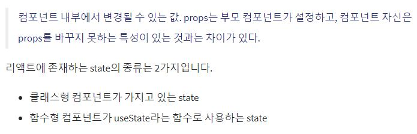
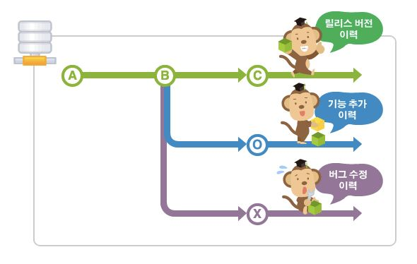
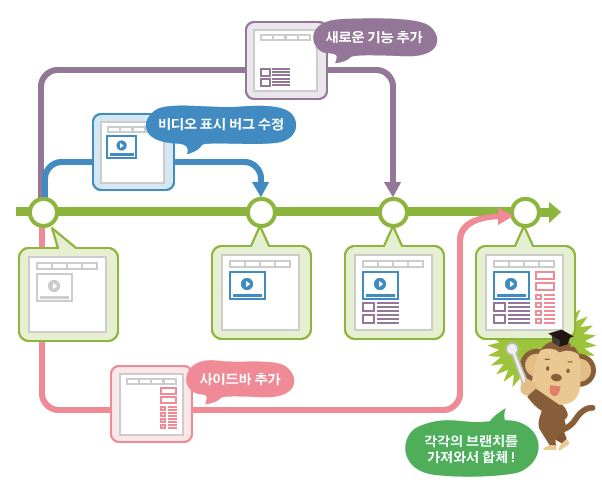

# 구본기 [201540202]

## [09월 29일]

### state와 클래스형 컴포넌트

#### state란?

  

#### 클래스형 컴포넌트의 state

컴포넌트에 state를 설정할 때는 constructor에 메서드를 작성하여 설정한다.
이는 컴포넌트의 생성자 메서드이고, 클래스형 컴포넌트에서 constructor를 작성할 때는 반드시 super(props)를 호출해줘야됌. 이 함수가 호출되면 현재 클래스형 컴포넌트가 상속받고 있는 리액트의 Component 클래스가 지닌 생성자 함수를 호출해 주기 때문
또한 컴포넌트의 state는 객체 형식이어야된다.

#### 클래스형 컴포넌트의 장점

* 클래스형 컴포넌트의 경우 state기능 및 라이프사이클 기능을 사용할 수 있고 임의 메세드를 정의할 수 있다.  
* 클래스형 컴포넌트에서는 render 함수가 꼭 있어야 하고, 그 안에서 보여 주어야 할 jsx를 반환해야한다.

#### state와 props의 차이점

* props와 state는 둘 다 컴포넌트에서 사용하거나 렌더링할 데이터를 담고 있으나 그 역할은 매우 다르다. 
* props는 부모 컴포넌트가 설정하고, state는 컴포넌트 자체적으로 지닌 값으로 컴포넌트 내부에서 값을 업데이트 할 수 있기 때문.  
* props를 사용한다고 해서 값이 무조건 고정적이지는 않다. 부모 컴포넌트의 state를 자식 컴포넌트의 props로 전달하고, 자식 컴포넌트에서 특정 이벤트가 발생할 때 부모 컴포넌트의 메서드를 호출하면 * * props도 유동적으로 사용할 수 있기 때문이다.  
 
추가자료 링크 : https://github.com/uberVU/react-guide/blob/master/props-vs-state.md  
https://lucybain.com/blog/2016/react-state-vs-pros/  

#### state를 사용할떄의 주의점

클래스형 컴포넌트든 함수형 컴포넌트든 state를 사용할 때 주의해야 할 사항이 있다.
state값을 바꿀때는 setState 혹은 useState를 통해 전달받은 세터 함수를 이용해야한다.
리액트에서 직접적으로 상태를 변경하는건 리액트 규칙에 위반되기 때문이다.

### 컴포넌트란?

컴포넌트(Component)란 조합하여 화면을 구성할 수 있는 블록을 의마합니다. 컴포넌트를 활용하면 화면을 빠르게 구조화하여 일괄적인 패턴으로 개발 할 수 있으며, 코드를 쉽게 이해하고 재사용할 수 있습니다.  
 
컴포넌트는 Vue의 가장 강력한 기능 중 하나입니다. 기본 HTML 엘리먼트를 확장하여 재사용 가능한 코드를 캡슐화하는 데 도움이 됩니다. 상위 수준에서 컴포넌트는 Vue의 컴파일러에 의해 동작이 추가된 사용자 지정 엘리먼트입니다. 경우에 따라 특별한 is 속성으로 확장 된 원시 HTML 엘리먼트로 나타낼 수도 있습니다.  
 
Vue 컴포넌트는 Vue인스턴스이기도 합니다. 그러므로 모든 옵션 객체를 사용할 수 있습니다. 그리고 같은 라이프사이클 훅을 사용할 수 있습니다.  
 
컴포넌트를 등록하는 방법은 전역(Global)과 지역(Local)의 두 가지의 방법이 있습니다. 지역 컴포넌트는 특정 인스턴스에서만 유효하고, 전역 컴포넌트는 모든 범위의 여러 인스턴스에서 공통으로 사용할 수 있습니다. 

#### map 함수

map() 메서드는 배열 내의 모든 요소 각각에 대하여 주어진 함수를 호출한 결과를 모아 새로운 배열을 반환을 한다.  
map함수는 (callbackFunction,thisArg) 두개의 매개변수가 있다.  
 
callbackFunction 에는 새로운 배열 요소를 생성하는 함수가 들어간다.  
currenValue : 처리할 현재 요소.  
index : 배열 내 현재 값의 인덱스.  
array : 현재 배열.  
thisArg : callbackFunction 내에서 this로 사용될 값.  

### 브랜치란?

소프트웨어를 개발할 때에 개발자들은 동일한 소스코드를 함께 공유하고 다루게 됩니다. 동일한 소스코드 위에서 어떤 개발자는 버그를 수정하기도 하고 또 다른 개발자는 새로운 기능을 만들어 내기도 하죠. 이와 같이 여러 사람이 동일한 소스코드를 기반으로 서로 다른 작업을 할 때에는 각각 서로 다른 버전의 코드가 만들어 질 수 밖에 없습니다.  

이럴 때, 여러 개발자들이 동시에 다양한 작업을 할 수 있게 만들어 주는 기능이 바로 '브랜치(Branch)' 입니다. 각자 독립적인 작업 영역(저장소) 안에서 마음대로 소스코드를 변경할 수 있지요. 이렇게 분리된 작업 영역에서 변경된 내용은 나중에 원래의 버전과 비교해서 하나의 새로운 버전으로 만들어 낼 수 있습니다.  

브랜치란 독립적으로 어떤 작업을 진행하기 위한 개념입니다. 필요에 의해 만들어지는 각각의 브랜치는 다른 브랜치의 영향을 받지 않기 때문에, 여러 작업을 동시에 진행할 수 있습니다.  
  
이렇게 만들어진 브랜치는 다른 브랜치와 병합(Merge)함으로써, 작업한 내용을 다시 새로운 하나의 브랜치로 모을 수 있습니다.  

여러 명이서 동시에 작업을 할 때에 다른 사람의 작업에 영향을 주거나 받지 않도록, 먼저 메인 브랜치에서 자신의 작업 전용 브랜치를 만듭니다. 그리고 각자 작업을 진행한 후, 작업이 끝난 사람은 메인 브랜치에 자신의 브랜치의 변경 사항을 적용합니다. 이렇게 함으로써 다른 사람의 작업에 영향을 받지 않고 독립적으로 특정 작업을 수행하고 그 결과를 하나로 모아 나가게 됩니다. 이러한 방식으로 작업할 경우 '작업 단위', 즉 브랜치로 그 작업의 기록을 중간 중간에 남기게 되므로 문제가 발생했을 경우 원인이 되는 작업을 찾아내거나 그에 따른 대책을 세우기 쉬워집니다. 
  

## [09월 15일]

### 리액트란?

#### React.JS는 프레임워크가 아닌 라이브러리

* 프레임워크 : 애플리케이션 구축 시 모든 애플리케이션의 공통적인 부분을 제공해줌. 필요한 기능이 이미 만들어져 있어 만들어진 '틀' 안에 '내용물'을 채워넣음으로써 완성시킴. 뼈대에 해당. 미리 만들어진 틀 밖으로 벗어나기가 어려움.  
* 라이브러리 : 필요한 부분만을 단독으로 가지고 와서 사용하는 것이 가능. 기능을 하게 하는 부품에 해당. 가벼움. React.JS는 유저 인터페이스를 만들기 위한 라이브러리  
 

#### React.JS의 장점

* 학습이 간단하다. 컴포넌트만을 사용하기 때문에 복잡하지 않음 
* 가상 DOM(Virtual DOM)을 사용한다. 
* 뛰어난 Garbage Collection, 메모리관리, 성능  
* UI를 컴포넌트화 하여 매우 간편한 UI 수정 및 재사용  
* 다른 프레임워크나 라이브러리와 혼용 가능. 이미 개발이 완료된 서비스에도 적용이 가능  
* 서버 & 클라이언트 사이드 렌더링 모두 지원  

#### React.JS의 단점

* 시각적으로 보여지는 부분만 컨트롤 할 수 있다.  
* IE8 이하는 지원하지 않음  

## [09월 08일]

### 클론코딩

* 클론 코딩은 실제로 존재하는 사이트나 앱의 코드를 보며 그대로 따라 만들면서, 해당 언어나 기술을 습득하는 방법이다.  
* 클론 코딩은 완성된 프로젝트를 클론해서 하나씩 완성해 가는 실습 위주의 학습으로 빠르고, 효과적이며 실용적이기 까지 한 학습 방법이다.  
* 클론 코딩의 경험은 향후 자기주도 학습으로 코딩을 하는데 많은 도움을 준다  

### 클론 코딩의 학습법

* 모르는 내용이나 코드가 있으면 반드시 찾아본다.  
* 클론 한 코드를 그대로 따라하지 말고 학습자의 개성을 살려 코딩한다. 
* 주석을 자세하게 달아둔다.  
* 학습한 내용을 문서화한다.  
* 지속적으로 커밋하고 포트폴리오로 만든다.  
* 학습한 내용을 기반으로 한 다른 프로젝트를 스스로 기획하고 개발한다.  

### 리액트의 장점

* 리액트의 장점은 자바스크립트로 작성되어있다는 것이다.  
* 리액트 떄문에 다른 언어를 배울 필요가 없다.  
* 리액트를 더 이상 사용하지 않는다 하더라도 자바스크립트의 지식은 그대로 남는다.  
* 리액트로 인해 자바스크립트 실력이 향상된다.  